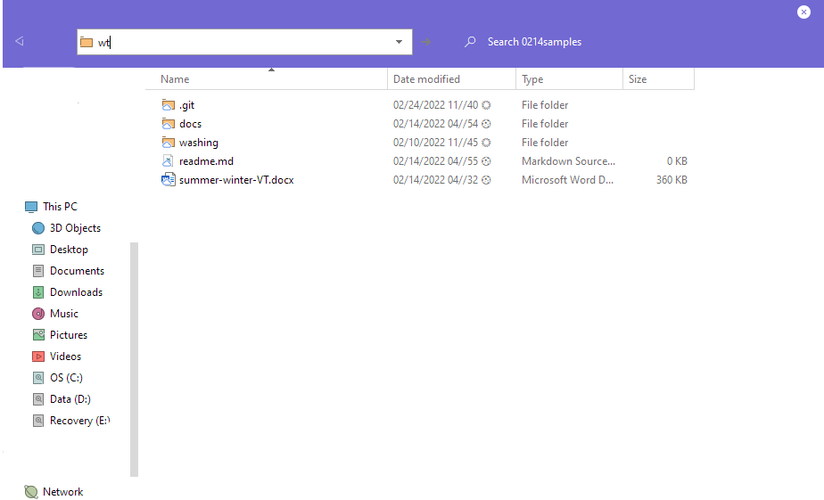

# How to convert a Word document into Markdown

Converting a Word document into Markdown is easier than it seems. With a few commands, you will easily convert a document into a format that is plaintext and compatible with many things. Successfully following this tutorial will result in a formatted Markdown file.

## Tools needed

- [Pandoc](download.html)
- [Formatted Word document](prepare.html)
- Command Line Program
  - *This program can be the default command line, Powershell, or Windows Terminal.*
- File Explorer
- Text editor of your choice

## Steps

1. Open File Explorer to the directory where your Word document is saved.
   - *Optional:* Move the Word document into a new, empty folder.
2. Type in the following command into the file path depending on the command line program you chose:
   - `cmd`
   - `wt`
   - `powershell`

    <figure>
    
    <figcaption> Figure 1: The file explorer in the current directory of the Word document with <code>wt</code> being entered into its path.
    </figure>

3. Type the following into the command line program, replacing the `<>`'s:

   ```bat
   pandoc -s <Word file name>.docx -t markdown --extract-media=images -o <Markdown filename>.md
   ```

4. Check the directory where you ran the command, there should be a Markdown file created and an images folder if images were in your Word document.
5. Open the newly created Markdown file in your text editor.
6. Clean up the text, following the [Markdown Guidelines](https://github.com/DavidAnson/markdownlint/blob/v0.25.1/doc/Rules.md#md033)
7. Save your edited document.


