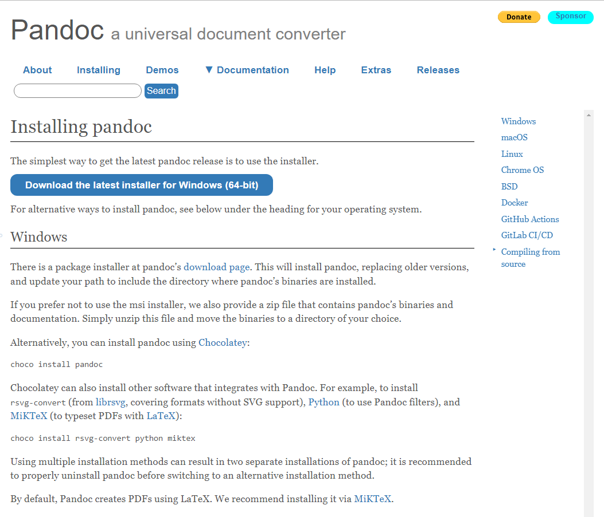
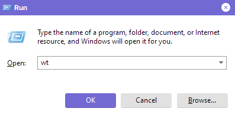

# How to download Pandoc

Pandoc is a program without a visual interface, meaning that it is used via the command line. This tutorial will allow you to properly install Pandoc and confirm that you can use the command line to run the program.  
**Note:** This tutorial is for a Windows device.

## Tools needed

- Command Line Program
  - *This program can be the default command line, Powershell, or Windows Terminal.*
- An internet connection
- Web browser

## Steps

1. Using your web browser, access <https://pandoc.org/installing.html>
2. Click on the `Download the latest installer for Windows (64-bit)` button to download the installer.
  
  <figure>
  <figcaption> Figure 1: The installation page of the Pandoc website.</figcaption></figure>

3. Click on the downloaded file, it will open an installer.
4. Read and Accept the liscense agreement.
    - *optional:* accept the installation for all users
5. Click next on the installer and wait for the installation to finish.
6. Once the installation is finished, you can close the installation window.
7. Press the <kbd>Win</kbd> + <kbd>R</kbd>  key at the same time. The run window will appear.
8. Type in the following command into the window depending on the command line program you chose:
   - `cmd`
   - `wt`
   - `powershell`

  <figure>
  <figcaption> Figure 2: The run window with <code>wt</code> as the current program </figcaption></figure>

9. Type `pandoc -v` into the command line. If there are no errors displayed, then you have succesfully installed pandoc.  
*Note:* If your command line is unable to find the program, make sure it was typed in correctly, and reinstall if needed.


