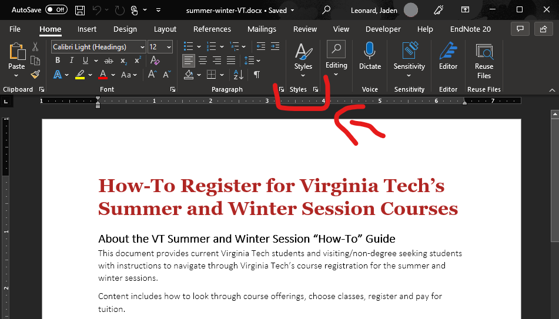

# How to prepare Word for Pandoc

While Pandoc can easily convert any Word document into a Markdown file, there are certain things you can do to create a conversion that translates easily. Completing this task will save you time later when you convert your document and double check the formatting.

## Tools needed

- Word document
- Microsoft Word

## Steps

1. Open the Word document in Microsoft Word.
2. Identify the `Styles` section on the ribbon section of Microsoft Word

    <figure>
    
    <figcaption> Figure 1: A example of where the Style section is.
    </figure>

    <figure>
    
    <figcaption> Figure 2: A example of where the Style section is.
    </figure>

3. Select the title of your Word document.
4. Apply the `Title` style to the text by clicking on the Title style.
5. Select the main sections of your document.
6. Sequentially, apply the `Heading 1` style to each main section.
7. Select the sub-sections of your document.
8. Sequentially, apply the `Heading 2` style to each sub-section.
9. Repeat these steps for every sub-section below, going up a header level each time.
10. Save your edited document.


